# Tests

In diesem Test werden folgende Äquivalenzklassen überprüft:
- Slider
- Checkbox
- Multiselect
- Selectbox

---

# ÜBERHAUPT NÖTIG?
Das Dashboard wurde mit Hilfe des Frameworks [Streamlit](https://streamlit.io) erstellt. 

---

## Slider

Mit hilfe des Sliders kann in diesem Testfall die Runde des Numerai Tournaments ausgewählt werden, ab der die Auswertung gestartet werden soll. Die erste Runde ist 284, die letzte 318 (Stand 07.06.2022).

In nachfolgenden Tests ist die Erwartung, dass ab einer Auswahl von Runde 307 oder höher keine Werte mehr für das Modell *kenfus* existieren. Dieses Modell wurde das letzte mal in Runde 306 verwendet.

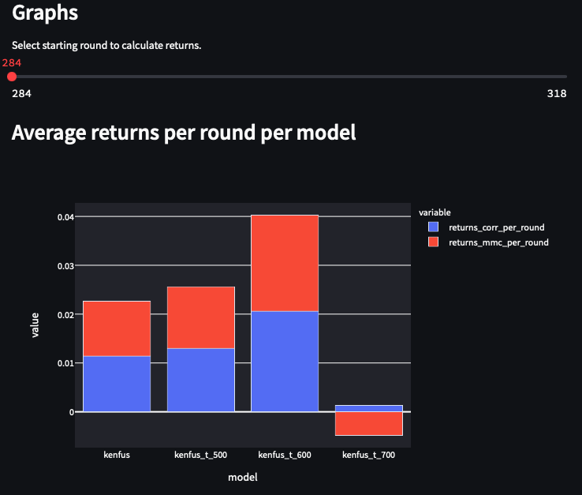
##### Fig. 1 - Slider und Graph mit Auswahl Runde 284

Wenn man den Wert des Sliders anpasst, sollte sich auch der Plot verändern.

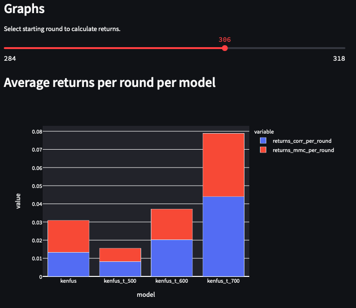
##### Fig. 2 - Slider und Graph mit Auswahl Runde 306

Da in Runde 306 noch alle 4 Modelle existieren, verändert sicht hier nur der Plot. Auch ist durch die Verbesserung der Werte zu sehen, dass die Modelle weiter entwickelt worden sind.

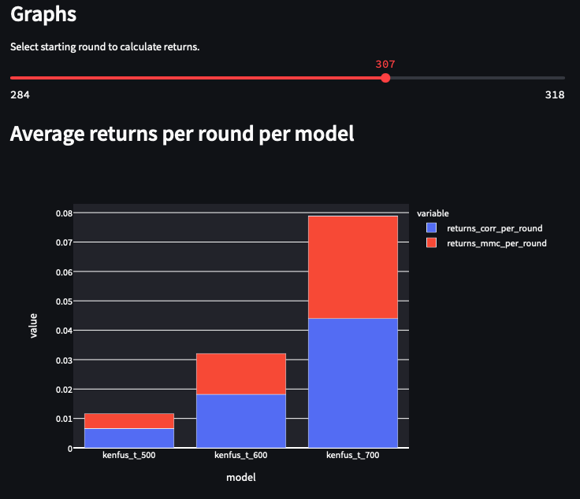
##### Fig. 3 - Slider und Graph mit Auswahl Runde 307

Wie zu erwarten ist ab Runde 307 erscheint das Modell *kenfus* nicht mehr im Plot. Der Slider funktioniert also korrekt.

## Checkbox

In diesem Test wird die Funktion einer Checkbox überprüft. In diesem Fall ist es die Checkbox für den "Detailed hover mode". Dieser fügt bei einigen Plots extra Informationen hinzu, wenn man mit der Maus über den Plot fährt. Betrachtet wird es am Beispiel *Correlation Reputation*. 

##### Fig. 4 - Checkbox "Detailed hover mode" aus

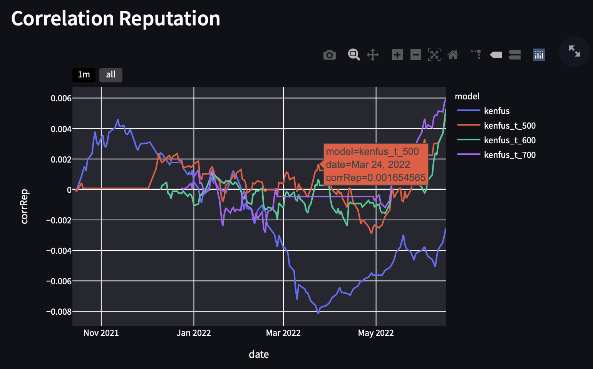
##### Fig. 5 - Plot *Correlation Reputation* mit "Detailed hover mode" aus

Ist die Checkbox wie in in Fig. 4 nicht aktiv, sieht die Zusatzinformation beim Mouseover aus wie in Fig. 5. Es wird der Modellname, das genaue Datum und die Correlation Reputation für diesen spezifischen Punkt auf dem Plot dargestellt.

##### Fig. 4 - Checkbox "Detailed hover mode" aktiviert

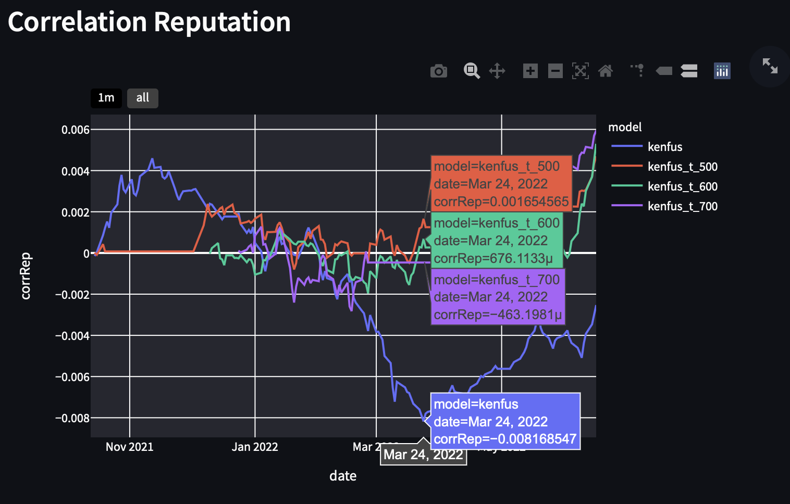
##### Fig. 5 - Plot *Correlation Reputation* mit "Detailed hover mode" aktiviert

Aktivert man den "Detailed hover mode", werden die selben Informationen wie in Fig. 4 dargestellt (Modellname, Datum, Correlation Reputation), aber nun für alle ausgewählten Modelle. Zusätzlich wird auf der X-Achse das Datum deutlich hervorgehoben.

Die Checkbox funktioniert korrekt.

## Multiselect

Die Multiselectbox wird in diesem Dashboard verwendet um die Modelle für die Auswertung zu selektieren. Standartmässig sind (alle) vier Modelle ausgewählt: *kenfus*, *kenfus_t_500*, *kenfus_t_600* und *kenfus_t_700*. Man aber auch Modelle abwählen und somit die Analyse anpassen.

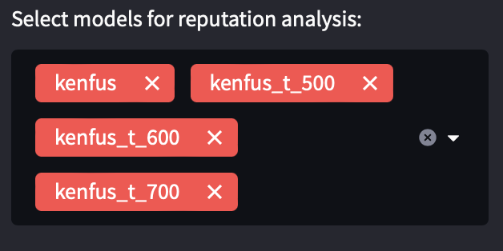
##### Fig 6. - Multiselect Standartauswahl

Der *Average returns per round per model* Plot sieht dann so aus:

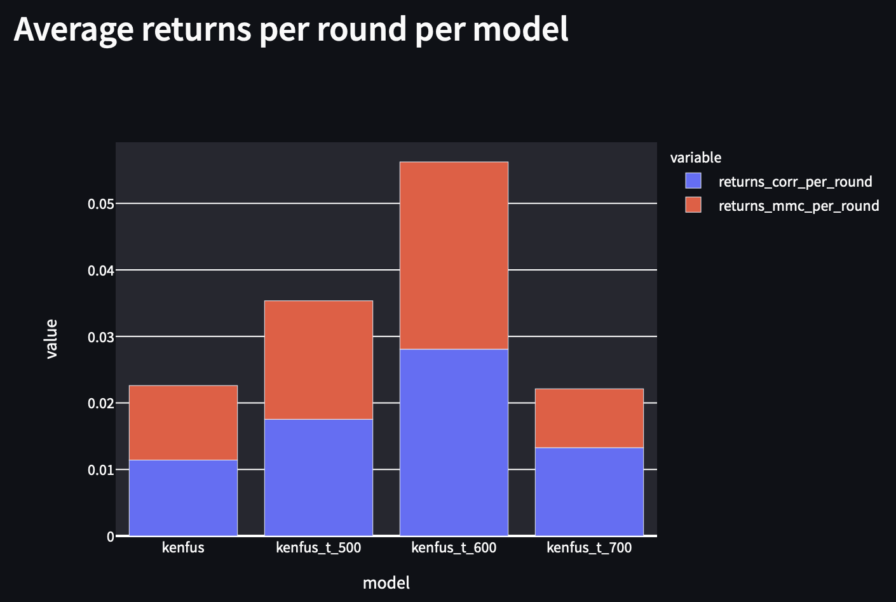
##### Fig 7. - *Average returns per round per model* Plot mit Multiselect Standartauswahl

Entfernt man jetzt Modelle aus der Multiselectbox, sollten diese auch im Plot verschwinden. Entfernt werden in diesem Test die Modelle *kenfus_t_600* und *kenfus_t_700*. Es sollten somit nur noch *kenfus* und *kenfus_t_500* im Plot dargestellt werden.

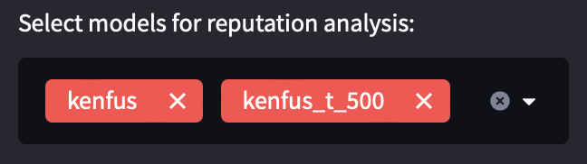
##### Fig 8. - Multiselect mit den Modellen *kenfus* und *kenfus_t_500*

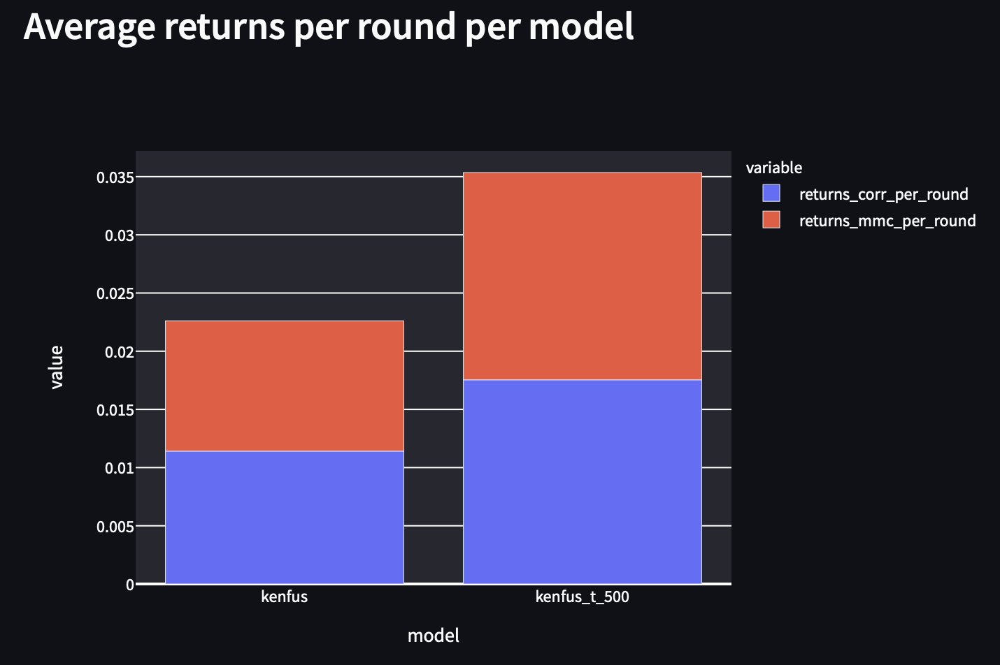
##### Fig 9. - *Average returns per round per model* Plot mit Modellen *kenfus* und *kenfus_t_500*

Im Plot sind nur noch die beiden ausgewählten Modelle zu sehen, somit ist dieser Test erfolgreich abgeschlossen.

## Selectbox

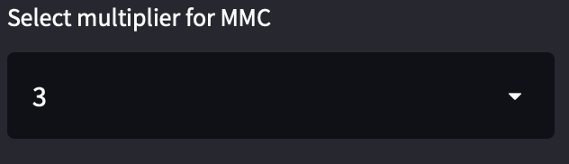
##### Fig 10. - Selectbox *MMC* Multiplikator

Mit der Selectbox kann man auswählen, welcher Multiplikator für die Numerai-Metrik *MMC* verwendet werden soll. Mögliche Auswahlen sind die Faktoren: 0.5, 1, 2 und 3. Als Standartauswahl ist ein Multiplikator von 3 gewählt.

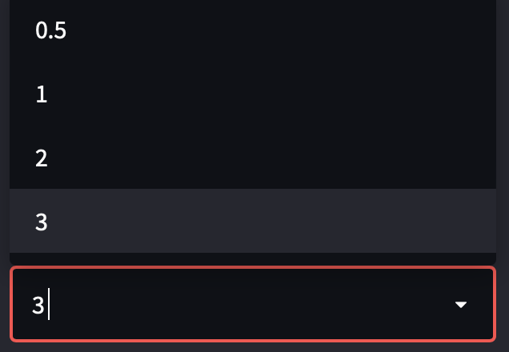
##### Fig 11. - Selectbox *MMC* Multiplikator Auswahlmöglichkeiten

Als Referenzplot wird bei diesem Test der *Average returns per model* Plot verwendet. Mit der Standarteinstellung von 3 als Multiplikator sieht der Plot folgendermassen aus:

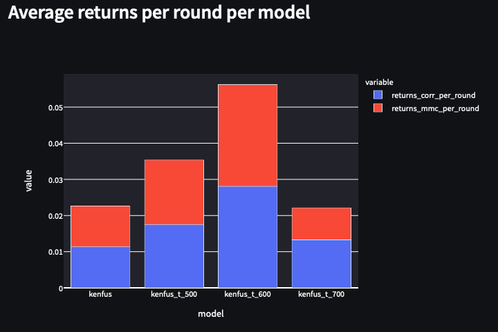
##### Fig. 1 - Selectbox mit Multiplikator 3

Passt man den Multiplikator an, sollte sich der Teil der *returns_mmc_per_round* (rot im Plot) verkleinern. Damit man es deutlich erkennen kann, wird der kleinste mögliche Faktor von 0.5 gewählt.

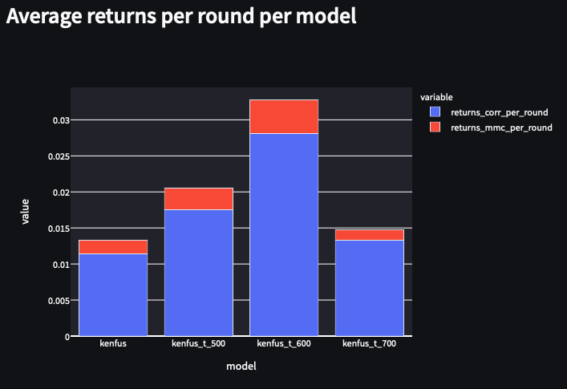
##### Fig. 1 - Selectbox mit Multiplikator 0.5

Unschwer zu erkennen hat sich der Anteil der *returns_mmc_per_round* deutlich verringert. Somit ist die Funktion der Selectbox gegeben.